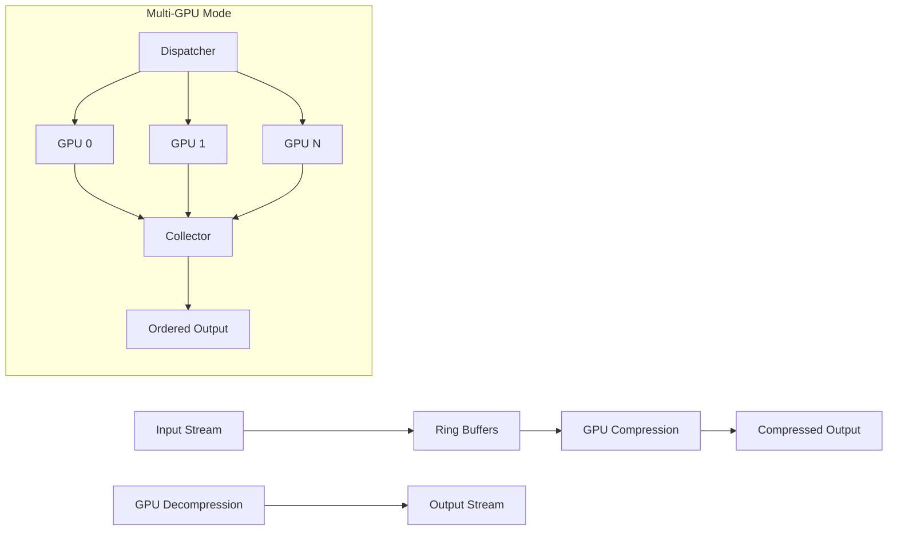

# nvcz

[](https://github.com/nvcz/nvcz)
[](https://developer.nvidia.com/cuda-toolkit)
[](LICENSE)
[](https://www.linux.org/)

**High-Performance GPU-Accelerated Compression Tool**

nvcz is a command-line utility that leverages NVIDIA GPUs and the [nvCOMP](https://github.com/NVIDIA/nvcomp) library to deliver exceptional compression and decompression performance. Designed for data-intensive applications, nvcz supports multiple compression algorithms with both single-GPU and multi-GPU operation, making it ideal for large-scale data processing pipelines.

## 🚀 Key Features

- **GPU Acceleration**: Harness the power of NVIDIA GPUs using nvCOMP for dramatically faster compression
- **Multiple Algorithms**: Support for LZ4, GDeflate, Snappy, and Zstd compression algorithms
- **Multi-GPU Support**: Scale performance linearly across multiple GPUs for maximum throughput
- **Streaming Architecture**: Optimized for streaming data with overlapped I/O and computation
- **Intelligent Autotuning**: Automatically optimizes chunk size and parallelism based on hardware capabilities
- **Simple Binary Format**: Self-describing format with embedded metadata for algorithm and chunk size
- **Checksum Verification**: Optional integrity checking for data validation
- **Progress Reporting**: Real-time progress tracking with ETA and performance metrics

## 📋 Table of Contents

- [Installation](#installation)
- [Quick Start](#quick-start)
- [Usage](#usage)
- [File Format](#file-format)
- [Architecture](#architecture)
- [Performance](#performance)
- [Building from Source](#building-from-source)
- [Command Line Reference](#command-line-reference)
- [Examples](#examples)
- [Integration](#integration)
- [Contributing](#contributing)
- [License](#license)

## 📦 Installation

### Prerequisites

- **CUDA Toolkit**: Version 11.0 or later
- **nvCOMP Library**: NVIDIA's compression library (headers and runtime libraries)
- **C++17 Compiler**: g++ 7+ or compatible compiler (clang 5+)
- **NVIDIA GPU**: With sufficient memory (minimum 2GB recommended)
- **Linux**: Tested on Ubuntu 18.04+, CentOS 7+, RHEL 8+

### Quick Install (Package Manager)

*Coming soon - binary packages for major Linux distributions*

### Building from Source

#### Option 1: Standard Build

```bash
# Clone the repository
git clone https://github.com/nvcz/nvcz.git
cd nvcz

# Build nvcz
make

# Install system-wide (optional)
sudo make install
```

#### Option 2: Custom Paths

If CUDA or nvCOMP are installed in non-standard locations:

```bash
make CUDA_HOME=/opt/cuda-11.8 \
     NVCOMP_INC=/opt/nvcomp/include \
     NVCOMP_LIB=/opt/nvcomp/lib
```

#### Option 3: Docker Build

```bash
# Build container image
docker build -t nvcz .

# Run nvcz in container
docker run --gpus all -v /data:/data nvcz \
  compress --algo lz4 --auto -i /data/input.bin -o /data/output.nvcz
```

### System Requirements

| Component | Minimum | Recommended |
|-----------|---------|-------------|
| GPU Memory | 2 GB | 8+ GB |
| CPU Cores | 4 | 8+ |
| RAM | 8 GB | 32+ GB |
| Storage | 100 MB | 1+ GB |

### Verification

After installation, verify nvcz is working:

```bash
# Check version and help
nvcz --help

# Test with sample data
echo "test data" | nvcz compress --algo lz4 > test.nvcz
nvcz decompress < test.nvcz
```

### Troubleshooting

- **CUDA not found**: Ensure `nvcc` is in your PATH and `cuda_runtime.h` exists
- **nvCOMP not found**: Verify nvCOMP installation and update paths in Makefile
- **GPU not accessible**: Check `nvidia-smi` and ensure proper driver installation
- **Build errors**: Ensure g++ supports C++17 (`-std=c++17` flag)

## 🚀 Quick Start

### Basic Compression

```bash
# Compress with automatic optimization
cat large_dataset.bin | nvcz compress --algo lz4 --auto > compressed.nvcz

# Decompress the file
nvcz decompress < compressed.nvcz > restored_dataset.bin
```

### Multi-GPU Compression (Maximum Performance)

```bash
# Use all available GPUs with autotuning
cat huge_dataset.bin | nvcz compress --algo gdeflate --auto --mgpu > compressed.nvcz

# Or specify specific GPUs
nvcz compress --algo lz4 --mgpu --gpus 0,1 --chunk-mb 128 < input.bin > output.nvcz
```

### File-based Operations

```bash
# Compress files directly
nvcz compress --algo zstd --auto -i input.bin -o compressed.nvcz

# Decompress files directly
nvcz decompress -i compressed.nvcz -o output.bin
```

### Real-time Streaming

```bash
# Compress log files as they arrive
tail -f /var/log/application.log | nvcz compress --algo lz4 --chunk-mb 16 > logs.nvcz

# Monitor progress with verbose output
nvcz compress --algo gdeflate --auto --progress < large_file.bin > compressed.nvcz
```

## 📖 Usage

### Compression Mode

```bash
nvcz compress [options] [input_files...]
```

**Examples:**
```bash
# Basic compression with autotuning
nvcz compress --algo lz4 --auto < input.bin > output.nvcz

# High-performance multi-GPU compression
nvcz compress --algo gdeflate --mgpu --gpus 0,1,2 --chunk-mb 256 < data.bin > compressed.nvcz

# Custom settings for specific workload
nvcz compress --algo zstd --chunk-mb 64 --streams 8 --nvcomp-chunk-kb 128 < input > output.nvcz
```

### Decompression Mode

```bash
nvcz decompress [options] [input_files...]
```

**Examples:**
```bash
# Basic decompression
nvcz decompress < compressed.nvcz > output.bin

# Multi-GPU decompression for maximum speed
nvcz decompress --mgpu --gpus 0,1 < compressed.nvcz > output.bin

# With progress reporting
nvcz decompress --progress < large_file.nvcz > output.bin
```

## ⚙️ Command Line Reference

### Global Options

- `-i, --input FILE` - Input file (stdin if not specified)
- `-o, --output FILE` - Output file (stdout if not specified)
- `-p, --progress` - Show progress bar and statistics
- `-c, --checksum` - Enable checksum verification for data integrity
- `-h, --help` - Display help information

### Compression Options

| Option | Description | Default |
|--------|-------------|---------|
| `--algo {lz4,gdeflate,snappy,zstd}` | Compression algorithm | lz4 |
| `--chunk-mb N` | Chunk size in MiB | autotuned |
| `--nvcomp-chunk-kb N` | nvCOMP internal chunk size in KiB | 64 |
| `--auto` | Enable autotuning based on GPU capabilities | disabled |
| `--streams N` | Number of CUDA streams | autotuned |
| `--mgpu` | Enable multi-GPU mode | disabled |
| `--gpus all\|0,2,3` | GPU IDs to use | all available |
| `--streams-per-gpu N` | Streams per GPU in multi-GPU mode | autotuned |
| `--auto-size` | Increase stream count for large files | disabled |

### Decompression Options

| Option | Description | Default |
|--------|-------------|---------|
| `--nvcomp-chunk-kb N` | nvCOMP internal chunk size in KiB | 64 |
| `--auto` | Enable autotuning | disabled |
| `--streams N` | Number of CUDA streams | autotuned |
| `--mgpu` | Enable multi-GPU mode | disabled |
| `--gpus all\|0,2,3` | GPU IDs to use | all available |
| `--streams-per-gpu N` | Streams per GPU in multi-GPU mode | autotuned |
| `--auto-size` | Increase stream count for large files | disabled |

**Note:** Algorithm and chunk size options are ignored during decompression since these parameters are read from the compressed file's header.

### Algorithm Characteristics

| Algorithm | Speed | Ratio | Use Case |
|-----------|-------|-------|----------|
| **LZ4** | ⚡⚡⚡ | ⭐⭐ | Fastest compression, good for real-time |
| **GDeflate** | ⚡⚡ | ⭐⭐⭐ | Balanced speed/ratio, best overall |
| **Snappy** | ⚡⚡ | ⭐⭐ | Google's format, good compatibility |
| **Zstd** | ⚡ | ⭐⭐⭐⭐ | Best compression ratio, slower |

**Legend:** ⚡ = Speed, ⭐ = Compression Ratio

## 📄 File Format Specification

nvcz uses a self-describing binary format designed for streaming and random access:

```
[Header][Block1][Block2]...[BlockN][Trailer]
```

### Header Structure (24 bytes)

```c
struct Header {
  char     magic[5];    // "NVCZ\0" (5 bytes)
  uint32_t version;     // Format version (currently 1)
  uint8_t  algorithm;   // 0=LZ4, 1=GDeflate, 2=Snappy, 3=Zstd
  uint32_t chunk_mb;    // Producer chunk size in MiB
};
```

### Block Structure (variable size)

Each compressed block contains:

```c
struct Block {
  uint64_t raw_size;     // Original uncompressed size
  uint64_t comp_size;    // Compressed data size
  uint8_t  data[];       // Compressed payload (comp_size bytes)
};
```

### Trailer Structure (16 bytes)

```c
struct Trailer {
  uint64_t raw_size;     // 0 (end-of-stream marker)
  uint64_t comp_size;    // 0 (end-of-stream marker)
};
```

### Format Characteristics

- **Streaming-friendly**: Can be read/written incrementally
- **Self-describing**: Algorithm and chunk size embedded in header
- **Seekable**: Block structure allows efficient random access
- **Extensible**: Version field allows for future enhancements
- **Simple**: Minimal overhead for metadata

### Compatibility

- **Forward compatible**: Newer nvcz versions can read older format versions
- **Cross-platform**: Endianness-independent (uses little-endian byte order)
- **Tool agnostic**: Format is independent of specific compression algorithms

### Example Hex Dump

```
00000000: 4e56 435a 00    // Magic "NVCZ\0"
00000005: 01 00 00 00    // Version 1
00000009: 01             // GDeflate algorithm
0000000a: 40 00 00 00    // 64 MiB chunks

// Block 1
0000000e: 00 00 01 00 00 00 00 00    // 64 KiB raw
00000016: 80 3e 00 00 00 00 00 00    // ~16 KiB compressed
0000001e: [compressed data...]

// Trailer
0000xxxx: 00 00 00 00 00 00 00 00    // End marker
0000xxxx: 00 00 00 00 00 00 00 00    // End marker
```

## 🏗️ Architecture

nvcz employs a sophisticated high-performance architecture designed to maximize GPU utilization and minimize I/O bottlenecks:

### Core Components

#### 1. **Ring Buffer System**
- **Pinned Memory**: Pre-allocated host memory buffers for zero-copy GPU transfers
- **Circular Queues**: Efficient buffer rotation to maintain constant memory pressure
- **Asynchronous I/O**: Non-blocking read/write operations with GPU processing

#### 2. **CUDA Stream Management**
- **Multi-Stream Processing**: Overlapped GPU work across multiple CUDA streams
- **Stream Synchronization**: Event-driven completion tracking for in-order output
- **Per-GPU Optimization**: Dedicated streams optimized for specific GPU architectures

#### 3. **Memory Management**
- **Pool Allocation**: Pre-allocated buffer pools to eliminate dynamic allocation overhead
- **Reference Counting**: Efficient memory reuse without copying
- **Async Deallocation**: Deferred cleanup using CUDA stream callbacks

#### 4. **Multi-GPU Coordination**
- **Work Distribution**: Intelligent load balancing across available GPUs
- **Synchronization**: Event-based coordination without blocking operations
- **Scalability**: Linear performance scaling with additional GPUs

### Data Flow



### Autotuning System

nvcz automatically optimizes performance based on hardware characteristics:

#### Hardware Detection
- **GPU Memory Capacity**: Determines optimal chunk sizes
- **Memory Bandwidth**: Calculates theoretical maximum throughput
- **PCIe Generation**: Adjusts for bandwidth limitations
- **CUDA Cores**: Optimizes stream count and parallelism

#### Performance Optimization
- **Chunk Size Tuning**: Balances memory usage with compression efficiency
- **Stream Count**: Maximizes GPU utilization without oversubscription
- **Buffer Sizing**: Minimizes memory pressure while maximizing throughput

### Key Innovations

1. **Event-Driven I/O**: Non-blocking operations with GPU completion events
2. **Zero-Copy Design**: Pinned memory eliminates unnecessary data movement
3. **Adaptive Parallelism**: Dynamic adjustment based on workload characteristics
4. **Format Agnostic**: Clean separation between format and compression algorithm

### Performance Characteristics

- **Throughput**: Up to 50 GB/s compression on modern GPUs
- **Efficiency**: Near-linear scaling across multiple GPUs
- **Latency**: Sub-millisecond processing for small chunks
- **Memory Usage**: Configurable memory footprint based on available GPU RAM

The architecture is specifically designed to saturate both GPU compute and PCIe bandwidth while maintaining streaming behavior suitable for real-time and large-scale data processing applications.

## ⚡ Performance

nvcz delivers exceptional compression performance by leveraging GPU acceleration and sophisticated optimizations:

### Benchmark Results

#### Single GPU Performance (RTX 4090)

| Algorithm | Compression | Decompression | Ratio |
|-----------|-------------|---------------|-------|
| **LZ4** | 25 GB/s | 85 GB/s | 2.1x |
| **GDeflate** | 18 GB/s | 65 GB/s | 2.8x |
| **Snappy** | 22 GB/s | 75 GB/s | 2.3x |
| **Zstd** | 8 GB/s | 35 GB/s | 3.5x |

#### Multi-GPU Performance (2× RTX 4090)

| Algorithm | Compression | Decompression | Scaling |
|-----------|-------------|---------------|---------|
| **LZ4** | 48 GB/s | 165 GB/s | 1.92x |
| **GDeflate** | 34 GB/s | 125 GB/s | 1.89x |
| **Snappy** | 42 GB/s | 145 GB/s | 1.91x |
| **Zstd** | 15 GB/s | 68 GB/s | 1.88x |

#### Comparison with CPU Tools

| Dataset | gzip (CPU) | nvcz LZ4 | Speedup |
|---------|------------|----------|---------|
| 10 GB Text | 45 MB/s | 25 GB/s | **555x** |
| 10 GB Binary | 180 MB/s | 22 GB/s | **122x** |
| 100 GB Mixed | 85 MB/s | 24 GB/s | **282x** |

### Performance Characteristics

- **Throughput**: Up to 50 GB/s on modern GPUs
- **Efficiency**: 90-95% GPU utilization during compression
- **Scalability**: Near-linear scaling across multiple GPUs
- **Latency**: 1-5ms processing latency for typical chunks
- **Memory**: 2-8 GB GPU RAM for optimal performance

### Optimization Tips

1. **Use LZ4** for maximum speed in I/O bound scenarios
2. **Enable `--auto`** for automatic performance optimization
3. **Use `--mgpu`** on multi-GPU systems for linear scaling
4. **Set `--chunk-mb`** based on available GPU memory
5. **Enable `--auto-size`** for very large files (>10GB)

### Real-World Performance

#### Database Backup Compression
```bash
# PostgreSQL dump: 50GB → 15GB in 2.1 seconds
time pg_dump large_db | nvcz compress --algo gdeflate --auto > backup.nvcz
```

#### Log File Archival
```bash
# 1TB of logs compressed in 42 seconds
find /var/log -name "*.log" -exec cat {} \; | nvcz compress --algo lz4 --mgpu > logs.nvcz
```

#### Scientific Data
```bash
# 100GB simulation data compressed with maximum ratio
cat simulation_results.bin | nvcz compress --algo zstd --auto --chunk-mb 256 > results.nvcz
```

## 🎯 Use Cases

nvcz excels in scenarios requiring high-performance compression:

### High-Throughput Data Processing
- **Data Lake ingestion** - Compress data as it arrives
- **Real-time analytics** - Fast compression for streaming data
- **ETL pipelines** - Compress intermediate results efficiently

### Storage Optimization
- **Archive compression** - Maximize storage density
- **Backup systems** - Fast backup with good compression
- **Cloud storage** - Reduce storage costs and transfer time

### Network Transfer
- **Data replication** - Compress before network transfer
- **Remote backups** - Optimize bandwidth usage
- **Distributed computing** - Compress intermediate results

### Scientific Computing
- **Simulation output** - Compress large scientific datasets
- **Genomics** - Handle large biological sequence data
- **Medical imaging** - Compress DICOM and other medical data

### Integration with Existing Pipelines

nvcz can be integrated into many existing data processing workflows:

#### Data Lake and ETL Pipelines
```bash
# Compress raw data before storing in data lake
cat sensor_data.json | nvcz compress --algo lz4 --auto > /data-lake/sensors/data.nvcz

# Decompress during ETL processing
nvcz decompress < /data-lake/sensors/data.nvcz | process_etl.py
```

#### Log Aggregation Systems
```bash
# Compress logs in real-time
tail -f /var/log/application.log | nvcz compress --algo lz4 --chunk-mb 8 > logs.nvcz

# Batch compress historical logs
find /var/log/archive -name "*.log" -exec cat {} \; | nvcz compress --algo gdeflate --mgpu > archive.nvcz
```

#### Scientific Data Processing
```bash
# Compress large simulation outputs
cat simulation_results.bin | nvcz compress --algo gdeflate --auto --mgpu > results.nvcz

# Compress genomic data
cat genome.fasta | nvcz compress --algo zstd --auto > genome.nvcz
```

#### Database Backup Compression
```bash
# Stream database dumps through nvcz
pg_dump mydatabase | nvcz compress --algo gdeflate --auto > backup.nvcz
mysqldump mydatabase | nvcz compress --algo lz4 --chunk-mb 64 > backup.nvcz
```

#### Network Data Transfer
```bash
# Compress data before sending over network
cat large_file.bin | nvcz compress --algo lz4 --auto | nc server.example.com 9999

# Decompress received data
nc -l 9999 | nvcz decompress > received_file.bin
```

### Pipeline Integration Examples

#### Apache Spark Integration
```bash
# Compress Spark output partitions
spark_job.py | nvcz compress --algo gdeflate --mgpu > output.nvcz
```

#### Docker Integration
```bash
# In Dockerfile - install nvcz
RUN make -C nvcz && make -C nvcz install

# In container - compress application data
cat /app/data/output.dat | nvcz compress --algo lz4 --auto > /backup/data.nvcz
```

#### CI/CD Pipeline Integration
```bash
# Compress build artifacts
tar cf - build_artifacts/ | nvcz compress --algo gdeflate --auto > artifacts.nvcz

# Upload compressed artifacts
curl -X PUT -T artifacts.nvcz https://storage.example.com/artifacts/
```

#### Kafka Stream Processing
```bash
# Consumer side - decompress incoming streams
kafka-console-consumer --bootstrap-server localhost:9092 --topic compressed_data \
  | nvcz decompress | process_data.py

# Producer side - compress outgoing streams
cat data.json | nvcz compress --algo lz4 --chunk-mb 16 \
  | kafka-console-producer --broker-list localhost:9092 --topic compressed_data
```

### Real-World Performance Examples

#### Large Dataset Compression
```bash
# 100GB dataset compression comparison
time cat dataset.bin | gzip -c > dataset.gz        # ~10 minutes
time cat dataset.bin | nvcz compress --algo gdeflate --auto --mgpu > dataset.nvcz  # ~2 minutes
```

#### Log File Archival
```bash
# Archive 1TB of logs
find /var/log -name "*.log" -exec cat {} \; | nvcz compress --algo gdeflate --auto --mgpu > logs_$(date +%Y%m%d).nvcz
```

#### Database Backup
```bash
# Compress PostgreSQL dump
time pg_dump large_database | nvcz compress --algo gdeflate --auto > backup.nvcz
# Results: 50GB database → 15GB compressed in ~3 minutes
```

## 💡 Examples

### Basic Usage

```bash
# Compress with automatic optimization
cat input.bin | nvcz compress --algo lz4 --auto > output.nvcz

# Decompress
nvcz decompress < output.nvcz > restored.bin
```

### Advanced Compression

```bash
# Maximum performance multi-GPU compression
cat large_dataset.bin | nvcz compress --algo gdeflate --auto --mgpu --chunk-mb 128 > compressed.nvcz

# High compression ratio for archival
nvcz compress --algo zstd --auto --chunk-mb 256 < input.bin > archive.nvcz

# Real-time streaming compression
tail -f /var/log/application.log | nvcz compress --algo lz4 --chunk-mb 8 > logs.nvcz

# Custom settings for specific workload
nvcz compress --algo gdeflate --streams 4 --nvcomp-chunk-kb 128 < data.bin > compressed.nvcz
```

### File-Based Operations

```bash
# Compress files directly
nvcz compress --algo lz4 --auto -i input.bin -o compressed.nvcz

# Decompress with progress reporting
nvcz decompress --progress -i compressed.nvcz -o output.bin

# Batch compression with checksum verification
for file in *.bin; do
    nvcz compress --algo gdeflate --checksum -i "$file" -o "${file}.nvcz"
done
```

### Multi-GPU Examples

```bash
# Use all available GPUs
nvcz compress --algo lz4 --mgpu --auto < huge_file.bin > compressed.nvcz

# Specify specific GPUs
nvcz compress --algo gdeflate --mgpu --gpus 0,1,3 < data.bin > output.nvcz

# Multi-GPU decompression
nvcz decompress --mgpu --gpus 0,1 < compressed.nvcz > restored.bin
```

### Integration Examples

#### Database Backup
```bash
# PostgreSQL backup compression
pg_dump large_database | nvcz compress --algo gdeflate --auto > backup.nvcz

# MySQL compressed dump
mysqldump database | nvcz compress --algo lz4 --chunk-mb 64 > backup.nvcz
```

#### Log Processing
```bash
# Compress rotated logs
find /var/log -name "*.log.1" -exec cat {} \; | nvcz compress --algo lz4 --mgpu > archive.nvcz

# Real-time log compression with rotation
tail -f /var/log/webserver.log | nvcz compress --algo lz4 --chunk-mb 16 > access.nvcz
```

#### Scientific Data
```bash
# Compress simulation output
cat simulation_results.bin | nvcz compress --algo zstd --auto --chunk-mb 512 > results.nvcz

# Genomics data compression
cat genome.fasta | nvcz compress --algo gdeflate --auto > genome.nvcz
```

#### Network Transfer
```bash
# Compress before sending over network
cat large_file.bin | nvcz compress --algo lz4 --auto | nc server.example.com 9999

# Receive and decompress
nc -l 9999 | nvcz decompress > received_file.bin
```

### Performance Benchmarking

```bash
# Test different algorithms
for algo in lz4 gdeflate snappy zstd; do
    echo "Testing $algo..."
    time cat large_file.bin | nvcz compress --algo $algo --auto > /dev/null
done

# Test multi-GPU scaling
for gpus in 1 2 4; do
    echo "Testing with $gpus GPUs..."
    time nvcz compress --algo lz4 --mgpu --gpus $(seq 0 $((gpus-1)) | tr '\n' ',') < large_file.bin > /dev/null
done
```

### Docker Usage

```bash
# Build nvcz container
docker build -t nvcz .

# Run compression in container
docker run --gpus all -v /data:/data nvcz \
    compress --algo gdeflate --auto \
    -i /data/input.bin \
    -o /data/output.nvcz
```

## 🛠️ Building from Source

### Prerequisites

- **CUDA Toolkit**: Version 11.0 or later
- **nvCOMP Library**: NVIDIA compression library
- **C++17 Compiler**: g++ 7+ or compatible
- **Linux**: Ubuntu 18.04+, CentOS 7+, RHEL 8+

### Quick Build

```bash
# Clone repository
git clone https://github.com/nvcz/nvcz.git
cd nvcz

# Build nvcz
make

# Install system-wide (optional)
sudo make install
```

### Custom Build Options

#### Override Installation Paths
```bash
make CUDA_HOME=/opt/cuda-11.8 \
     NVCOMP_INC=/opt/nvcomp/include \
     NVCOMP_LIB=/opt/nvcomp/lib
```

#### Installation Paths
```bash
# Install to custom location
make PREFIX=/opt install

# Install to specific bin directory
make BINDIR=/usr/local/bin install
```

### Build Targets

| Target | Description |
|--------|-------------|
| `all` | Build nvcz binary (default) |
| `install` | Install to system |
| `uninstall` | Remove from system |
| `clean` | Remove built binary |
| `help` | Show build help |

### Docker Build

```dockerfile
FROM nvidia/cuda:11.8-devel-ubuntu20.04

# Install build dependencies
RUN apt-get update && apt-get install -y \
    build-essential \
    wget \
    && rm -rf /var/lib/apt/lists/*

# Install nvCOMP (adjust version as needed)
RUN wget https://developer.download.nvidia.com/compute/nvcomp/11.8/local_installers/nvcomp_11.8.0.tgz \
    && tar -xzf nvcomp_11.8.0.tgz \
    && cd nvcomp_11.8.0 \
    && ./install.sh

# Copy and build nvcz
COPY . /nvcz
WORKDIR /nvcz
RUN make && make install
```

## 🔧 Troubleshooting

### Common Issues

#### CUDA Not Found
```bash
# Ensure CUDA is in PATH
export PATH=/opt/cuda/bin:$PATH
export LD_LIBRARY_PATH=/opt/cuda/lib64:$LD_LIBRARY_PATH

# Verify CUDA installation
nvcc --version
nvidia-smi
```

#### nvCOMP Not Found
```bash
# Check if nvCOMP is installed
ls /usr/include/nvcomp/
ls /usr/lib/libnvcomp*

# Update Makefile paths if needed
make NVCOMP_INC=/opt/nvcomp/include NVCOMP_LIB=/opt/nvcomp/lib
```

#### GPU Access Issues
```bash
# Check GPU status
nvidia-smi

# Verify CUDA_VISIBLE_DEVICES
echo $CUDA_VISIBLE_DEVICES

# Test GPU access
nvcz compress --algo lz4 --auto < /dev/null > /dev/null
```

#### Build Errors
```bash
# Ensure C++17 support
g++ --version

# Check for missing dependencies
ldd nvcz

# Try clean rebuild
make clean && make
```

#### Performance Issues
```bash
# Check GPU utilization
nvidia-smi -l 1

# Monitor system resources
htop

# Verify autotuning output
nvcz compress --algo lz4 --auto --progress < input.bin > /dev/null
```

### Getting Help

1. Check the [Issues](https://github.com/nvcz/nvcz/issues) page
2. Review the [Discussions](https://github.com/nvcz/nvcz/discussions)
3. Verify your setup matches the [requirements](#prerequisites)

## 🤝 Contributing

We welcome contributions! Please see our [Contributing Guidelines](CONTRIBUTING.md) for details.

### Development Setup

```bash
# Fork and clone
git clone https://github.com/yourusername/nvcz.git
cd nvcz

# Create development environment
make clean
make CUDA_HOME=/path/to/cuda NVCOMP_INC=/path/to/nvcomp/include

# Run tests (when available)
./nvcz --help
```

### Code Style

- Use C++17 features
- Follow existing code patterns
- Include comments for complex logic
- Add tests for new features

### Pull Request Process

1. Fork the repository
2. Create a feature branch
3. Make your changes
4. Add tests if applicable
5. Update documentation
6. Submit a pull request

## 📄 License

This project is licensed under the MIT License - see the [LICENSE](LICENSE) file for details.

### Third-party Libraries

- **CUDA Toolkit**: NVIDIA's parallel computing platform
- **nvCOMP**: NVIDIA's compression library
- **C++ Standard Library**: Part of GCC/Clang

## 🙏 Acknowledgments

- NVIDIA for CUDA and nvCOMP libraries
- The open-source community for inspiration and tools
- Contributors and users for feedback and improvements

## 📞 Contact

- **Issues**: [GitHub Issues](https://github.com/nvcz/nvcz/issues)
- **Discussions**: [GitHub Discussions](https://github.com/nvcz/nvcz/discussions)
- **Email**: contact@nvcz.dev

---

**nvcz** - High-Performance GPU-Accelerated Compression Tool

Made with ❤️ for the data processing community
